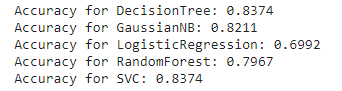
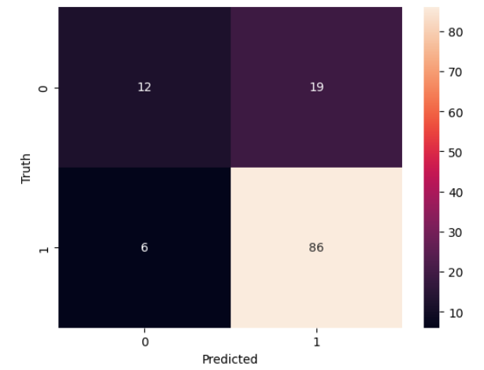

### Loan_Eligibility_Prediction 💰✅
#### Overview :
This repository contains an end-to-end project focused on predicting house loan eligibility. The project includes comprehensive Exploratory Data Analysis (EDA) conducted using Tableau to visualize and analyze the dataset. The primary goal is to construct predictive models utilizing Decision Tree, Gaussian Naive Bayes, Logistic Regression, Random Forest, and Support Vector Classifier (SVC) algorithms to determine whether an individual qualifies for a house loan or not.

Kaggle link : https://rb.gy/2y21l0

Tableau link : https://public.tableau.com/app/profile/yasmine.jalil/vizzes
  #### EDA with Tableau :

 

#### EDA with python :
-->Check out Loan_eligibility_prediction.ipynb
#### Insights 🔮
- Applicants without dependents demonstrate a strong interest in loans, while those with one or more dependents have a higher approval rate.
- Semi-urban areas exhibit a notable tendency towards loan applications.
- Individuals who are not self-employed are more inclined to apply for loans.
- Married males show a higher likelihood of both applying for loans and having their applications approved.
- A positive credit history increases the likelihood of loan approval.
- High income does not guarantee loan approval; other factors are considered in the decision-making process.

#### Model Training Results :
Here is a comparison of all models accuracies :

Both SVC and RandomForest Classifier are giving very good performance and their accuracy seems to be very close to each other with SVC leading in terms of performance. 
##### - SVC :
  
  
##### - RandomForest Classifier :

  
  

 #### Flask App :

  
Click to expand

- Form page to input users data :

 
 
 - Prediction results :
   
 

